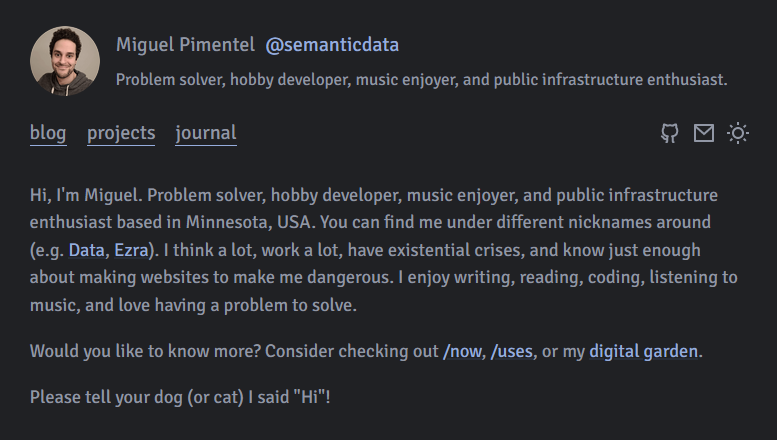

<h1 align=center>📓 MiguelPimentel.do</h1>

  
  
  
  
  

## Introduction

Personal website powered by [Zola](https://www.getzola.org/), and themed with [serene](https://github.com/isunjn/serene).

## Screenshot

## Changes from Upstream

- New *layout*: `Page`.
- New header *partial* `_header-journal.html`.
- New `/now`, `/uses`, and `/meta` sections and pages.

### Accessibility

Replaced all failing[^1] color variables with shades of the same color that returned passing scores.

| Variable                  | Old Color | New Color | Old Score | New Score |
| ------------------------- | --------- | --------- | --------- | --------- |
| `primary-color`           | `#698BCF` | `#3F537C` | `3.39` | `7.67`    |
| `primary-color-dark`      | `#698BCF` | `#96ADDD` | `4.75` | `7.14`    |
| `text-pale-color`         | `#9AA2B9` | `#4C515C` | `2.55` | `7.96`    |
| `text-pale-color-dark`    | `#5d6470` | `#ADB1B7` | `2.70` | `7.47`    |
| `callout-note-color`      | `#698BCF` | `#3F537C` | `3.39` | `7.67`    |
| `callout-note-color-dark` | `#698BCF` | `#96ADDD` | `4.75` | `7.14`    |

### Useful Commands

| **Command**  | Description                                                                       |
| ------------ | --------------------------------------------------------------------------------- |
| `zola build` | Only builds the site into the `/public` folder, which is ignored in `.gitignore`. |
| `zola serve` | Builds and serves the site locally, watches for changes, refreshes automatically. |

## Acknowledgments

The theme's default icons come from [Remix Icon](https://remixicon.com/).

## License

Source code in this repository is available under the [MIT](LICENSE) license.

[^1]: Color Contrast Checker: passing scores ≥ 7.00.
